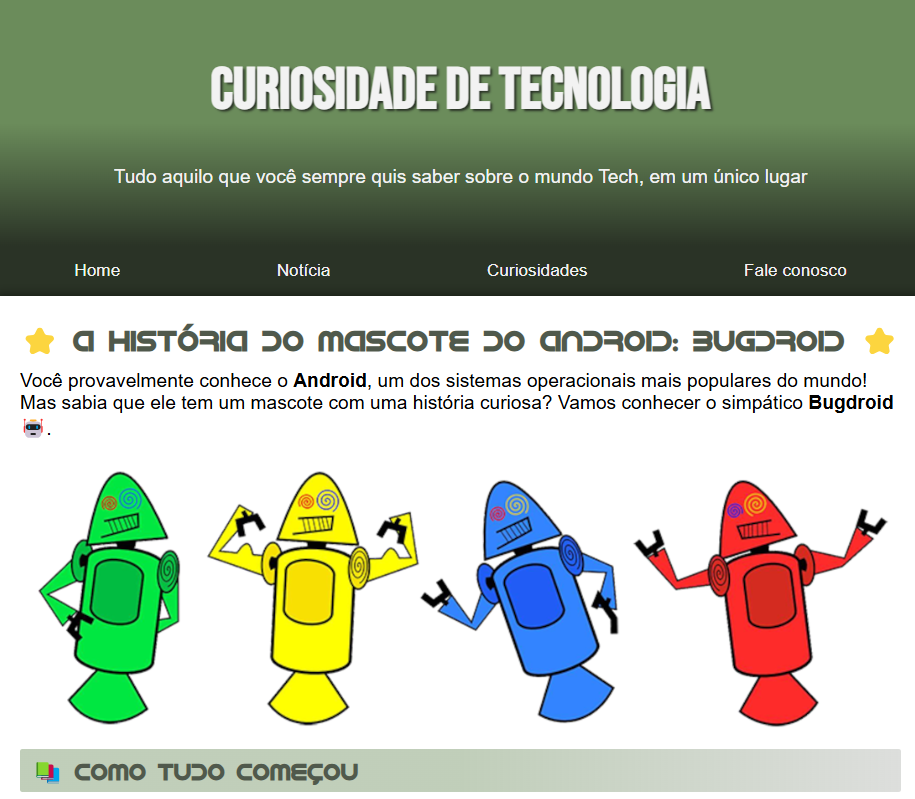
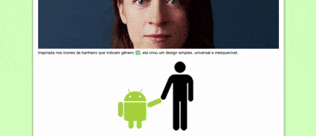

# 🤖 **Como Surgiu o Mascote do Android**

<p align="center">
  
</p>

Projeto criado durante o desafio do **Curso em Vídeo**, com o objetivo de fortalecer habilidades em **HTML** e **CSS**. Essa aplicação explora a origem do famoso mascote do Android, combinando conteúdo envolvente com boas práticas de desenvolvimento front-end.

---

## 🛠️ **Tecnologias e Ferramentas Utilizadas**

### 
- Estruturação com **tags semânticas**:
  - `header`, `main`, `footer` para uma organização clara e acessível.
  - `article`, `aside` para destacar informações relevantes e adicionais.
- Conteúdo rico e funcional:
  - Títulos (`h1`, `h2`, `h3`) e textos (`p`) bem hierarquizados.
  - (`nav`) para a navegação entre as seções.
  - Links (`a`) para navegação intuitiva.
  - Imagens responsivas com `picture`, `source` e `img`.
  - Listas estruturadas (`ul`, `li`) e elementos como `abbr` e `strong` para maior significado e ênfase.

### 
- **Estilização Responsiva**:
  - Design inteligente que se adapta a qualquer tela **sem necessidade de `@media-query`**.
- **Tipografia Personalizada**:
  - Uso de fontes externas do **Google Fonts**.
  - Fonte exclusiva do **Android** para um toque autêntico.
- **Visual Moderno**:
  - Estilos pensados para oferecer uma experiência visual limpa e envolvente.

---

## 🌟 **Características do Projeto**
- **História envolvente**: Apresenta a origem do mascote Android de forma clara e interativa.
- **Design Responsivo**: Compatível com qualquer dispositivo, garantindo acessibilidade e usabilidade.
- **Boas práticas**: Código organizado, com foco em semântica e legibilidade.

---

## 🚀 **Como Executar o Projeto**
1. Clone este repositório:
   ```bash
   git clone https://github.com/brunotxrs/como-surgiu-o-mascote-do-android.git

2. Abra o arquivo index.html no navegador de sua preferência para visualizar o projeto.

## 🎨 **Demonstração Visual**
<p align="center">
  
</p>

## 👨🏻‍💻 **Acesse o projeto finalizado**
 [Como Surgiu o Mascote do Android - online](https://github.com/brunotxrs/historia-do-mascote-android)


## 🏆 **Motivação e Aprendizado**
Participar deste desafio foi uma oportunidade incrível para:

Aprimorar meu conhecimento em **HTML** e **CSS**.
Explorar o uso de fontes personalizadas e responsividade sem  `@media-query`.
Consolidar boas práticas no desenvolvimento web.

🙌 **Agradecimentos**

Agradeço ao [Curso em Vídeo](https://www.cursoemvideo.com/) pela proposta do desafio e à comunidade de desenvolvedores que incentiva o aprendizado contínuo.

---
Developed with ❤️, by [Bruno Teixeira](https://www.instagram.com/bruno_txrs/)

---
